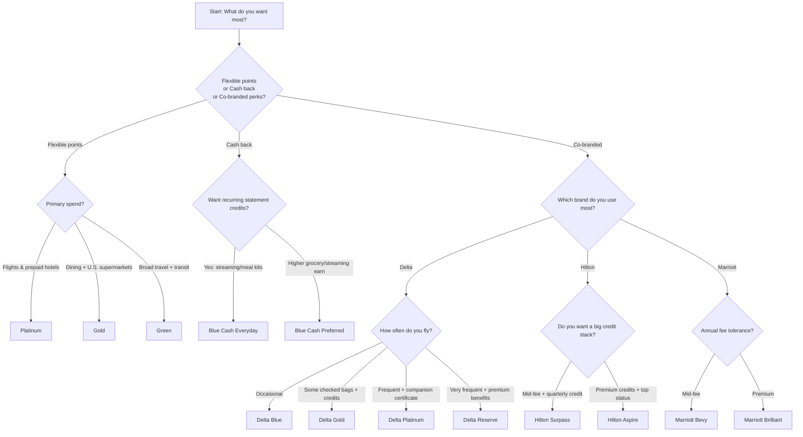

# American Express US Personal Credit Cards Deep Research Report

## Executive summary

As of **2026-02-25** (America/Chicago), the “core” American Express US personal portfolio breaks into three practical tiers (by annual fee) and three reward “currencies” (flexible points, cash back, and co-branded travel points). For the cards where current public Amex “Terms, Conditions & Disclosures” pages were accessible, the headline structure is:

**Premium / lifestyle & travel credits (>$500 AF).**  
The **Platinum Card** sits alone at the top of the flexible-points stack with a **$895 annual fee** and a large suite of high-face-value credits (Digital Entertainment, Resy, lululemon, Hotel, etc.). citeturn21view0turn37view0turn37view1turn37view2turn37view4  
On the co-branded side, the premium “credits + elite status” pattern repeats with **Hilton Aspire** ($550 AF; large Hilton-related credits) and **Marriott Brilliant** ($650 AF; dining credit + annual free night award). citeturn34view3turn34view6turn37view10turn34view11turn33search2  
For frequent Delta flyers, **Delta Reserve** uses a similar premium model (high fee + premium travel benefits), currently **$650 AF**. citeturn32view10  

**Mid-fee / “optimized earning” and targeted credits ($95–$350 AF).**  
Within flexible points, **Gold** and **Green** are the key earners: Gold concentrates value into dining and U.S. grocery spend plus statement-credit style lifestyle benefits, while Green focuses on broad travel/transit/restaurant earning plus CLEAR. citeturn11view1turn12view0turn12view2turn20view0  
In co-brands, “mid-fee” often means “useful annual statement credits + travel perks,” e.g., **Delta Gold** (Delta Stays credit + Delta flight credit after spend) and **Hilton Surpass** (quarterly Hilton statement credit). citeturn31search0turn32view4turn37view7turn34view7  
For Marriott, **Bevy** is a mid-fee “everyday points + spend-to-free-night” design. citeturn35view1turn35view5turn37view13  

**No-fee / “keep it simple” ($0 AF).**  
The strongest $0-fee “everyday” option, based on accessible Amex offer terms, is **Blue Cash Everyday** (Disney Streaming + Home Chef credits; bonus cash back categories). citeturn22view0turn22view4turn14view2turn22view3  
For Delta, **Delta Blue** appears as the no-fee on-ramp with restaurant + Delta purchase multipliers. citeturn32view13turn32view15  

**Highest flexible-points earning (headline categories).**
- **Gold**: strong everyday multipliers at **U.S. supermarkets** and **restaurants** (as described in the current Amex offer terms). citeturn11view2turn12view3  
- **Green**: **3X** on broad **travel**, **transit**, and **restaurants**. citeturn20view0  
- **Platinum**: **5X** on eligible air/prepaid hotel travel purchases (as described in the Platinum terms). citeturn21view4  

**Cards with the largest “coupon book” credits (highest face value).**
- **Platinum**: $300 Digital Entertainment + $400 Resy + $300 lululemon + $600 Hotel + other benefits/credits (some credits may have enrollment and/or category restrictions). citeturn37view0turn37view1turn37view2turn37view4turn21view4  
- **Hilton Aspire**: up to $400 Hilton Resort statement credits (semiannual structure) and up to $200 airline-related statement credits (quarterly structure), plus other Hilton-related perks. citeturn34view6turn33search0turn34view3  
- **Marriott Brilliant**: $300 dining credit plus annual free night award structure. citeturn37view10turn33search2turn34view11  

## Methodology and assumptions

**Date of access.**  
All web sources were accessed on **2026-02-25** (America/Chicago). Some Amex “Terms, Conditions & Disclosures” pages show APR data “accurate as of 02/25/26,” consistent with this access date. citeturn20view0  

**Source hierarchy.**
1. **Official American Express US offer / rates / benefit terms pages** (the “   
   *Terms, Conditions & Disclosures*” pages under americanexpress.com) were prioritized as the **verification source** for annual fees, earn rates, welcome offers, and stated credits. citeturn21view0turn20view0turn22view0turn32view4turn34view7turn34view11  
2. Secondary cross-checks were pulled from entity["organization","USCreditCardGuide","credit card review site"] (for card universe completeness and known availability changes) and entity["organization","The Points Guy","travel rewards media"] (for valuations and comparative framing). citeturn9view0turn36search0  

**Definition of “current cards” (user-requested assumption).**  
Interpreting “cards available to new applicants as of 2026-02-25,” this report treats a card as **currently offered** if a **live** Amex US offer/terms page was accessible and did **not** redirect to an “offer no longer available” message on 2026-02-25. citeturn25view0turn25view1  
Cards that *appear to exist historically* but redirect to “offer no longer available” (e.g., Amex EveryDay, Cash Magnet) are listed explicitly as **not available to new applicants** based on the redirect pages. citeturn25view0turn25view1  

**Valuation approach for “net welcome bonus value.”**
- When a points currency valuation was explicitly observable from TPG sources retrieved during this run, I used it to estimate “welcome offer value.” For example:  
  - **Delta SkyMiles**: TPG cites **1.25¢/mile** in the context of February 2026 valuations. citeturn36search3  
  - **Marriott Bonvoy**: TPG cites **0.7¢/point** in the context of February 2026 valuations. citeturn36search10  
  - **Amex Membership Rewards**: TPG states **2.0¢/point** in a periodically updated Membership Rewards valuation explainer (noting “September 2025 valuations” in the excerpt retrieved here). citeturn36search7  
- For currencies not explicitly priced in accessible excerpts (notably Hilton Honors), I mark net bonus value as **not calculable from captured sources** rather than guessing. citeturn36search0  

## Current personal Amex lineup overview

Based on the accessible official Amex offer pages plus cross-checking the USCreditCardGuide Amex card compilation, the following personal cards were **fully or largely verifiable** from Amex terms pages on 2026-02-25:

- Flexible points (Membership Rewards): Platinum, Gold, Green. citeturn21view0turn11view1turn20view0  
- Cash back: Blue Cash Everyday, Blue Cash Preferred. citeturn22view0turn23view0  
- Airline co-brand (Delta): Delta Blue, Delta Gold, Delta Platinum, Delta Reserve. citeturn32view13turn32view4turn32view7turn32view10  
- Hotel co-brand (Hilton): Hilton Surpass, Hilton Aspire. citeturn34view7turn34view3  
- Hotel co-brand (Marriott): Marriott Brilliant, Marriott Bevy. citeturn34view11turn35view1  

**Cards identified as not currently available to new applicants (redirected on 2026-02-25).**
- Amex EveryDay (offer page redirected to “offer no longer available”). citeturn25view0  
- Cash Magnet (offer page redirected to “offer no longer available”). citeturn25view1  

**Universe completeness caveat (explicit).**  
USCreditCardGuide’s Amex card list includes additional “partner” or limited-access variants (e.g., Schwab/Morgan Stanley Platinum variants) and invitation-only products. Those were **not fully extracted** into the same detail level here because the required live, public, non-redirecting Amex offer/terms pages for those variants were not captured in the tool outputs available in this run. citeturn9view0turn37view5  

## Card comparisons

### Annual fee, welcome offer, estimated welcome value, and key credits

**Interpretation.** “Net welcome value” below is **(estimated welcome offer value − annual fee)** where a valuation was available in captured TPG excerpts; otherwise it is **N/A**. Welcome offers shown as “as high as” are treated as **maximum possible**. citeturn21view3turn11view2turn36search0turn36search3turn36search10turn36search7  

| Card | Card type | Rewards currency | Annual fee | Welcome offer (as-of 2026-02-25) | Est. welcome value | Est. net welcome value | Key credits (headline) |
|---|---|---:|---:|---|---:|---:|---|
| Platinum | Charge | MR | $895 | Up to 175,000 MR after $12,000 / 6 mo | ~$3,500 (at 2.0¢/MR) | ~$2,605 | Digital Entertainment $300; Resy $400; lululemon $300; Hotel $600; Uber One $120 (see terms) |
| Gold | Charge | MR | $325 | Up to 60,000 MR after $6,000 / 6 mo | ~$1,200 (at 2.0¢/MR) | ~$875 | Dining $120/yr; Resy $100/yr (semiannual); Uber Cash (monthly, amount varies by terms) |
| Green | Charge | MR | $150 | 40,000 MR after $3,000 / 6 mo | ~$800 (at 2.0¢/MR) | ~$650 | CLEAR Plus up to $209/yr |
| Blue Cash Everyday | Credit | Cash back | $0 | Up to $200 after $2,000 / 6 mo | $200 | $200 | Disney Streaming $84/yr; Home Chef $180/yr |
| Blue Cash Preferred | Credit | Cash back | $0 intro first year, then $95 | Up to $300 after $3,000 / 6 mo | $300 | $300 (yr 1) | Disney Streaming $120/yr |
| Delta Blue | Credit | Delta miles | $0 | **Not captured** in accessible excerpt | N/A | N/A | None captured (beyond general program benefits) |
| Delta Gold | Credit | Delta miles | $0 intro first year, then $150 | Up to 90,000 miles (tiered) / 6 mo | ~$1,125 (at 1.25¢/mile) | ~$1,125 (yr 1) | Delta Stays $100/yr; Delta flight credit $200/yr after spend |
| Delta Platinum | Credit | Delta miles | $350 | Up to 100,000 miles (tiered) / 6 mo | ~$1,250 (at 1.25¢/mile) | ~$900 | Delta Stays up to $150/yr |
| Delta Reserve | Credit | Delta miles | $650 | Up to 125,000 miles (tiered) / 6 mo | ~$1,562.50 (at 1.25¢/mile) | ~$912.50 | Delta Stays up to $200/yr |
| Hilton Surpass | Credit | Hilton points | $150 | 130,000 Hilton points after $3,000 / 6 mo | N/A | N/A | Hilton statement credits $50/quarter ($200/yr) |
| Hilton Aspire | Credit | Hilton points | $550 | **Bonus points value not captured** in excerpt | N/A | N/A | Hilton Resorts $400/yr (semiannual); flight-related credits up to $200/yr (quarterly) |
| Marriott Brilliant | Credit | Marriott points | $650 | **Welcome offer amount not captured** in excerpt | N/A | N/A | Brilliant Dining Credit $300; annual free night award (up to 85k) |
| Marriott Bevy | Credit | Marriott points | $250 | 85,000 Marriott points after $5,000 / 6 mo | ~$595 (at 0.7¢/pt) | ~$345 | Free Night Award (up to 50k) after $15k annual spend |

**Source notes (table).**
- Platinum annual fee and offer: citeturn21view0turn21view3; Platinum credit headings: citeturn37view0turn37view1turn37view2turn37view4turn21view4  
- Gold annual fee and credits/earning: citeturn11view1turn11view2turn12view0turn12view2turn12view3  
- Green annual fee/offer/CLEAR/earning: citeturn20view0  
- Blue Cash Everyday annual fee/offer/earn/credits: citeturn22view0turn22view2turn22view3turn22view4turn14view2  
- Blue Cash Preferred annual fee/offer/earn/credits: citeturn23view0turn23view2turn23view3  
- Delta Gold annual fee/offer & core credits: citeturn32view4turn32view5turn31search0turn32view6  
- Delta Platinum & Delta Reserve annual fees/offers: citeturn32view7turn32view8turn32view10turn32view11  
- Delta Stays credit amounts by card: citeturn29search7  
- Hilton Surpass annual fee/offer/earn/credits: citeturn34view7turn34view8turn37view7turn37view9  
- Hilton Aspire annual fee and credits: citeturn34view3turn34view6turn33search0turn34view4  
- Marriott Bevy annual fee/offer/earn/spend-free-night: citeturn35view1turn35view2turn37view13turn35view5turn37view14  
- Marriott Brilliant annual fee/earn/dining credit/free night: citeturn34view11turn37view12turn37view10turn33search2  
- Valuations: TPG monthly valuations page for Feb 2026 exists: citeturn36search0; Delta 1.25¢: citeturn36search3; Marriott 0.7¢: citeturn36search10; MR 2.0¢ reference: citeturn36search7  

### Mermaid decision flow for choosing among major tiers

## Card-by-card details

The sections below follow the user-requested fields: **card name, type, welcome bonus & spend, earning rates, annual fee, credits (frequency/item/amount/enrollment/limits), and other notable benefits**. Where a detail was not observable in captured sources, it is called out explicitly as **Not captured / ambiguous**.

### Flexible points cards earning Membership Rewards

**Platinum Card** (Membership Rewards; charge card). citeturn21view0turn21view3turn21view4  
- **Card type:** Charge. citeturn21view0  
- **Welcome offer:** “As high as 175,000” MR points after **$12,000** eligible spend in the first **6 months** (exact amount disclosed before acceptance). citeturn21view3turn21view4  
- **Core earning (captured excerpts):** Platinum includes “5X Air and Hotel” structures (see benefit terms for category definitions/limits). citeturn21view4  
- **Annual fee:** **$895**. citeturn21view0  
- **Credits / statement benefits (captured headings; eligibility rules apply):**
  - Annual, **Digital Entertainment Credit**, **$300**, enrollment requirements/eligible services not captured in excerpt; see terms. citeturn37view0  
  - Annual, **Resy Credit**, **$400**, enrollment/eligible purchase rules not captured in excerpt; see terms. citeturn37view1  
  - Annual, **lululemon Credit**, **$300**, enrollment/eligible purchase rules not captured in excerpt; see terms. citeturn37view2  
  - Annual, **Hotel Credit**, **$600**, booking/eligibility rules not captured in excerpt; see terms. citeturn37view4  
  - Annual, **Uber One Credit**, **$120**, statement credits on Uber One membership fees; account linking required; see terms for timing/eligibility. citeturn21view4  
  - Monthly, **Uber Cash benefit** (amount not captured in excerpt), **expires each month**; requires adding card to Uber account; see terms for monthly deposit amount and eligibility. citeturn37view3  
- **Other notable benefits (high-level; see terms for details):** extensive lounge access and partner travel programs are referenced throughout the terms (e.g., Delta Sky Club access rules, Priority Pass enrollment language, etc.). citeturn14view0  

**Gold Card** (Membership Rewards; charge card). citeturn11view1turn11view2turn12view3  
- **Card type:** Charge. citeturn11view1  
- **Welcome offer:** “As high as 60,000” MR points after **$6,000** eligible spend in the first **6 months** (exact points disclosed before acceptance). citeturn11view2  
- **Earning rates (explicitly stated in offer terms):**
  - **4X** at restaurants worldwide. citeturn12view3  
  - **4X** at U.S. supermarkets (up to the offer-stated annual cap). citeturn12view3  
  - **3X** on flights booked directly with airlines or on amextravel.com. citeturn12view3  
  - **2X** on prepaid hotels and other eligible purchases through amextravel.com. citeturn12view3  
  - **1X** on other eligible purchases. citeturn12view3  
- **Annual fee:** **$325**. citeturn11view1  
- **Credits / statement benefits (as listed in terms):**
  - Semiannual, **Resy Credit**, **$50 Jan–Jun + $50 Jul–Dec (total $100/yr)**, **Enrollment required**, eligible purchases at Resy; see terms for exclusions. citeturn12view0  
  - Monthly, **Dining Credit**, **$10/mo (total $120/yr)**, **Enrollment required**, eligible partners include listed dining merchants/services; see terms. citeturn12view2  
  - Monthly, **Uber Cash**, **$10/mo (total $120/yr)**, requires adding the card to an Uber account; unused monthly Uber Cash does not carry over (per Uber Cash mechanics). citeturn12view2turn37view3  
  - **Not captured in excerpts:** additional brand-specific credits are implied in the Gold terms page but were not captured with explicit dollar amounts in this run. citeturn10view0  
- **Other notable benefits:** Membership Rewards transfer ecosystem availability is commonly described by TPG as including 17 airline + 3 hotel partners (counts may change). citeturn36search11  

**Green Card** (Membership Rewards; charge card). citeturn20view0  
- **Card type:** Charge (Pay Over Time feature referenced in terms). citeturn20view0  
- **Welcome offer:** **40,000 MR** points after **$3,000** eligible spend in the first **6 months**. citeturn20view0  
- **Earning rates (explicitly stated):**
  - **3X** on eligible travel purchases (broad definition includes airfare/hotels/cruises/tours, third-party travel sites, Amex Travel, etc.). citeturn20view0  
  - **3X** on transit purchases (includes trains/taxis/rideshare/ferries/tolls/parking/buses/subways). citeturn20view0  
  - **3X** at restaurants (with exclusions for certain venue-coded transactions). citeturn20view0  
  - **1X** on other eligible purchases. citeturn20view0  
- **Annual fee:** **$150**. citeturn20view0  
- **Credits / statement benefits:**
  - Annual, **CLEAR Plus credit**, up to **$209 per calendar year**, enrollment required; auto-renewal language applies. citeturn20view0  

### Cash back cards

**Blue Cash Everyday** (cash back; credit card). citeturn22view0turn22view3turn14view2turn22view4  
- **Card type:** Credit. citeturn22view0  
- **Welcome offer:** “As high as $200” after **$2,000** eligible spend in the first **6 months**. citeturn22view2  
- **Earning rates (explicitly stated):**
  - **3%** cash back at U.S. supermarkets (up to **$6,000/year**, then 1%). citeturn22view3  
  - **3%** cash back on U.S. online retail purchases (up to **$6,000/year**, then 1%). citeturn22view3  
  - **3%** cash back at U.S. gas stations (up to **$6,000/year**, then 1%). citeturn22view3  
  - **1%** on other eligible purchases. citeturn22view3  
- **Annual fee:** **$0**. citeturn22view0  
- **Credits / statement benefits:**
  - Monthly, **Disney Streaming Credit**, up to **$7/mo** (up to **$84/yr**), **Enrollment required**, qualifying purchases must be made at Disney+/Hulu/ESPN U.S. sites, with exclusions for third-party billing. citeturn22view4  
  - Monthly, **Home Chef statement credit**, up to **$15/mo** (up to **$180/yr**), enrollment/merchant processing timing restrictions apply. citeturn14view2  

**Blue Cash Preferred** (cash back; credit card). citeturn23view0turn23view3turn23view2  
- **Card type:** Credit. citeturn23view0  
- **Welcome offer:** “As high as $300” after **$3,000** eligible spend in the first **6 months**. citeturn23view2  
- **Earning rates (explicitly stated):**
  - **6%** cash back at U.S. supermarkets (up to **$6,000/year**, then 1%). citeturn23view3  
  - **6%** cash back on eligible U.S. streaming subscriptions from select providers. citeturn23view3  
  - **3%** cash back on transit. citeturn23view3  
  - **3%** cash back at U.S. gas stations. citeturn23view3  
  - **1%** on other eligible purchases. citeturn23view3  
- **Annual fee:** **$0 intro first year, then $95**. citeturn23view0  
- **Credits / statement benefits:**
  - Monthly, **Disney Streaming Credit**, up to **$10/mo** (up to **$120/yr**), **Enrollment required**, with notable third-party billing exclusions. citeturn23view0turn23view4  

### Delta co-branded cards

These cards earn Delta miles and have Delta-specific benefits; Delta Stays statement-credit amounts by card tier are described on an Amex-published Delta credit card benefits explainer. citeturn29search7  

**Delta Blue** (Delta miles; credit card). citeturn32view13turn32view15  
- **Annual fee:** **$0**. citeturn32view13  
- **Earning (captured excerpt):** **2X** at restaurants worldwide; **2X** on Delta purchases; other categories not captured here. citeturn32view15  
- **Welcome offer:** not captured (bonus language present but amount not captured in excerpt). citeturn32view14  

**Delta Gold** (Delta miles; credit card). citeturn32view4turn32view5turn31search0turn32view6  
- **Annual fee:** **$0 intro first year, then $150**. citeturn32view4  
- **Welcome offer:** up to **90,000** miles total on a tiered threshold: first 70,000 at $3,000 spend, then +20,000 at total $5,000 spend, within 6 months (offer end date appears in offer terms). citeturn31search0turn32view5  
- **Earning (captured excerpt):** **2X** at restaurants worldwide (other earn categories may exist but were not captured in excerpt). citeturn32view6  
- **Credits / statement benefits (captured in offer terms):**
  - Annual, **Delta Stays statement credit**, up to **$100/year**, for eligible prepaid bookings via Delta Stays (timing and eligibility restrictions apply). citeturn31search0turn29search7  
  - Annual (earned after spend), **Delta flight credit (Delta eCredit)**, **$200** after **$10,000** eligible purchases in a calendar year; expires within one year from issuance; limit one credit per calendar year per Card Account. citeturn31search0  

**Delta Platinum** (Delta miles; credit card). citeturn32view7turn32view8turn32view9turn29search7  
- **Annual fee:** **$350**. citeturn32view7  
- **Welcome offer:** up to **100,000** miles total on a tiered threshold (80,000 + 20,000 within 6 months, per offer terms structure). citeturn32view8  
- **Earning (captured excerpt):** **2X** at restaurants; **3X** at hotels (other earn categories may exist but were not captured in excerpt). citeturn32view9  
- **Credits / statement benefits:** Delta Stays credit described as up to **$150/year** for this tier in the Amex-published Delta benefits explainer. citeturn29search7  

**Delta Reserve** (Delta miles; credit card). citeturn32view10turn32view11turn32view12turn29search7  
- **Annual fee:** **$650**. citeturn32view10  
- **Welcome offer:** up to **125,000** miles total on a tiered threshold (100,000 + 25,000 within 6 months, per offer terms structure). citeturn32view11  
- **Earning (captured excerpt):** **3X** on Delta purchases (other earn categories may exist but were not captured in excerpt). citeturn32view12  
- **Credits / statement benefits:** Delta Stays credit described as up to **$200/year** for this tier in the Amex-published Delta benefits explainer. citeturn29search7  

### Hilton co-branded cards

**Hilton Surpass** (Hilton points; credit card). citeturn34view7turn34view8turn37view7turn37view9  
- **Annual fee:** **$150**. citeturn34view7  
- **Welcome offer:** **130,000** Hilton bonus points after **$3,000** eligible spend in **6 months**. citeturn34view8  
- **Earning rates (explicitly stated):**
  - **12X** at Hilton portfolio properties (bookings and incidentals; with channel requirements). citeturn37view9  
  - **6X** at U.S. restaurants, U.S. supermarkets, and U.S. gas stations (excluding superstores/warehouse clubs). citeturn37view9  
  - **4X** on eligible U.S. online retail purchases. citeturn37view9  
- **Credits / statement benefits:**
  - Quarterly, **Hilton statement credits**, up to **$50 per calendar quarter** (up to **$200/year**) for eligible Hilton-portfolio charges (bookings and incidentals as described), with room-charge mechanics for incidentals. citeturn37view7turn37view8  

**Hilton Aspire** (Hilton points; credit card). citeturn34view3turn34view6turn33search0turn34view4  
- **Annual fee:** **$550**. citeturn34view3  
- **Welcome offer:** bonus-points framework present, but the **numeric bonus amount was not captured** in accessible excerpt from the current terms page in this run. citeturn34view4  
- **Earning rates (captured excerpt):** **7X** at U.S. restaurants, airfare (direct or Amex Travel), and select major car rental companies (as defined in terms). citeturn34view4  
- **Credits / statement benefits / hotel credits:**
  - Semiannual, **Hilton Resorts statement credits**, up to **$200 Jan–Jun + $200 Jul–Dec** (up to **$400/year**), enrollment/participating resorts list and strict room-charge mechanics apply. citeturn34view6  
  - Quarterly, **flight-related statement credits**, up to **$50 per quarter** (up to **$200/year**) for airfare purchased directly with airlines or via Amex Travel (as described in captured excerpt). citeturn33search0  
  - **Per booking / on-property (not statement credit):** $100 property credit mechanics are described for certain eligible Aspire Card Benefit Rate bookings, applied on the hotel bill (not the Amex statement), with exclusions. citeturn33search0  

### Marriott co-branded cards

**Marriott Bevy** (Marriott points; credit card). citeturn35view1turn35view2turn37view13turn35view5  
- **Annual fee:** **$250**. citeturn35view1  
- **Welcome offer:** **85,000** Marriott bonus points after **$5,000** eligible spend in **6 months**. citeturn35view2  
- **Earning rates (explicitly stated):**
  - Base: **2X** points on eligible purchases. citeturn37view14  
  - On first **$15,000** eligible purchases per calendar year: **4X** at restaurants worldwide and **4X** at U.S. supermarkets (with exclusions). citeturn37view13turn37view14  
  - **6X** at participating Marriott properties and certain Marriott retail/online stores. citeturn37view13turn37view14  
- **Credits / statement benefits:**
  - Spend-triggered, annual, **Free Night Award** (up to **50,000** points) after **$15,000** eligible purchases in a calendar year; expires one year from issuance; top-up up to 15,000 points referenced. citeturn35view5turn33search2  

**Marriott Brilliant** (Marriott points; credit card). citeturn34view11turn37view10turn37view12turn33search2  
- **Annual fee:** **$650**. citeturn34view11  
- **Welcome offer:** the extracted excerpt did not include the numeric welcome offer amount; bonus posting mechanics appear in the terms. citeturn34view12  
- **Earning rates (explicitly stated):**
  - **6X** at participating Marriott properties and certain Marriott retail/online stores. citeturn37view12  
  - **3X** on airfare charged directly with passenger airlines (exclusions apply). citeturn37view12  
  - **3X** at restaurants worldwide. citeturn37view12  
- **Credits / statement benefits:**
  - **Brilliant Dining Credit**, **$300** (frequency and merchant definitions not captured in excerpt; see terms). citeturn37view10  
  - Annual, **Free Night Award** (up to **85,000** points) after renewal (per extracted terms excerpt). citeturn33search2  

## Cross-card normalized credits table

This table lists **credits and credit-like benefits** explicitly observed in the captured Amex offer terms excerpts. Amounts/frequencies are stated exactly when captured; if a frequency was not visible in captured excerpts, it is labeled **Not captured** (even if commonly understood elsewhere). Shared, limited-time “offers” appearing across many terms pages (e.g., Venue Collection concessions statement credit) are included where directly observed.

| Card | Frequency | Credit item | Amount / value | Enrollment required (Y/N) | Notes / restrictions (captured) |
|---|---|---:|---:|:---:|---|
| Platinum | Annual (details not captured) | Digital Entertainment Credit | $300 | Not captured | Eligibility, merchants, and cadence not captured in excerpt. citeturn37view0 |
| Platinum | Annual (details not captured) | Resy Credit | $400 | Not captured | Eligibility, cadence not captured in excerpt. citeturn37view1 |
| Platinum | Annual (details not captured) | lululemon Credit | $300 | Not captured | Eligibility, cadence not captured in excerpt. citeturn37view2 |
| Platinum | Annual (details not captured) | Hotel Credit | $600 | Not captured | Booking channel/requirements not captured in excerpt. citeturn37view4 |
| Platinum | Annual | Uber One Credit | $120 | Not captured | Statement credits for Uber One membership fees; see terms for details. citeturn21view4 |
| Platinum | Monthly (benefit expires monthly) | Uber Cash benefit | Amount not captured | Not captured | Uber Cash expires monthly; card must be added to Uber account. citeturn37view3 |
| Gold | Monthly | Dining Credit | $10/mo ($120/yr) | Y | Enrollment required; eligible partners/rules in terms. citeturn12view2 |
| Gold | Semiannual | Resy Credit | $50 Jan–Jun + $50 Jul–Dec ($100/yr) | Y | Enrollment required; eligible Resy purchases per terms. citeturn12view0 |
| Gold | Monthly | Uber Cash benefit | $10/mo ($120/yr) | Not captured | Requires adding card to Uber account; monthly Uber Cash mechanics apply. citeturn12view2turn37view3 |
| Green | Annual | CLEAR Plus Credit | Up to $209 | Not captured | Enrollment in CLEAR required; statement credit per calendar year. citeturn20view0 |
| Blue Cash Everyday | Monthly | Disney Streaming Credit | Up to $7/mo ($84/yr) | Y | Must enroll via Amex; qualifying purchases at Disney+/Hulu/ESPN U.S. sites; annual subscription earns one month’s credit. citeturn22view4 |
| Blue Cash Everyday | Monthly | Home Chef statement credit | Up to $15/mo ($180/yr) | Y | Subscription purchase requirements and processing timing constraints apply. citeturn14view2 |
| Blue Cash Preferred | Monthly | Disney Streaming Credit | Up to $10/mo ($120/yr) | Y | Must enroll via Amex; annual subscription earns one month’s credit. citeturn23view0turn23view4 |
| Delta Gold | Annual | Delta Stays statement credit | Up to $100 | Not captured | Eligible prepaid hotel/vacation rental via Delta Stays; timing and eligibility restrictions apply. citeturn31search0turn29search7 |
| Delta Gold | Annual (after spend) | Delta flight credit (Delta eCredit) | $200 | N/A | Issued after $10k eligible purchases; expires within one year; limit one per calendar year. citeturn31search0 |
| Delta Platinum | Annual | Delta Stays statement credit | Up to $150 | Not captured | Amount by tier described in Amex Delta explainer; see terms for eligibility. citeturn29search7 |
| Delta Reserve | Annual | Delta Stays statement credit | Up to $200 | Not captured | Amount by tier described in Amex Delta explainer; see terms for eligibility. citeturn29search7 |
| Hilton Surpass | Quarterly | Hilton statement credit | Up to $50/quarter ($200/yr) | Not captured | Eligible Hilton portfolio charges; incidentals must be room-charged and paid with card; posting timing applies. citeturn37view7turn37view8 |
| Hilton Aspire | Semiannual | Hilton Resorts statement credit | Up to $200 Jan–Jun + $200 Jul–Dec ($400/yr) | Not captured | Eligible purchases must be made directly with participating Hilton Resorts; incidentals must be room-charged and paid with Aspire. citeturn34view6 |
| Hilton Aspire | Quarterly | Flight-related statement credit | Up to $50/quarter ($200/yr) | Not captured | Airfare charged directly with airline or via Amex Travel; exclusions apply. citeturn33search0 |
| Hilton Aspire | Per booking (bill credit) | Hilton property credit (on-property) | Up to $100 | N/A | Applied to hotel bill (not Amex statement); requires specific booking channel/rate references; exclusions apply. citeturn33search0 |
| Marriott Brilliant | Not captured | Brilliant Dining Credit | $300 | Not captured | Cadence and specific merchant definitions not captured in excerpt. citeturn37view10 |
| Marriott Brilliant | Annual (renewal benefit) | Free Night Award | Up to 85,000 points | N/A | Issued after renewal; top-up rules referenced. citeturn33search2 |
| Marriott Bevy | Annual (after spend) | Free Night Award | Up to 50,000 points | N/A | Earned after $15k spend in a calendar year; expires one year; top-up up to 15k referenced. citeturn35view5 |

### Credits frequently appearing across multiple cards as “offers” in terms pages

A recurring cross-card item appearing in multiple Amex offer terms pages in this run is the **American Express Venue Collection Concessions Statement Credit** (10% back, up to $250/year, enrollment required, offer end date 12/31/2026). It appears in card terms beyond just one product line (cash back, hotel, and Marriott terms captured here). citeturn14view2turn14view3turn35view4turn34view10turn31search0  

## Primary cross-verification sources used

- Official American Express “Terms, Conditions & Disclosures” pages for each card referenced throughout (multiple sources in this run). citeturn21view0turn11view1turn20view0turn22view0turn32view4turn34view7turn35view1turn34view11  
- USCreditCardGuide Amex card list (used to cross-check the overall card universe and note availability changes). citeturn9view0  
- The Points Guy February 2026 valuations page and related pages for valuation snippets used in estimated welcome-offer value calculations. citeturn36search0turn36search3turn36search10turn36search7  
- Amex-published Delta benefits explainer (used as a secondary-Amex source for Delta Stays credit amounts by tier). citeturn29search7  

**Unresolved gaps explicitly noted (from this run).**  
A small number of cards implied by secondary lists (including no-fee Hilton and no-fee Marriott variants) could not be fully verified from captured, non-redirecting Amex offer terms pages in this run; therefore, they are not presented with full card-by-card specs here. The same applies to partner-restricted Platinum variants whose benefit enroll links appear inside the Platinum terms but whose distinct offer pages were not captured. citeturn9view0turn37view5turn25view0turn25view1